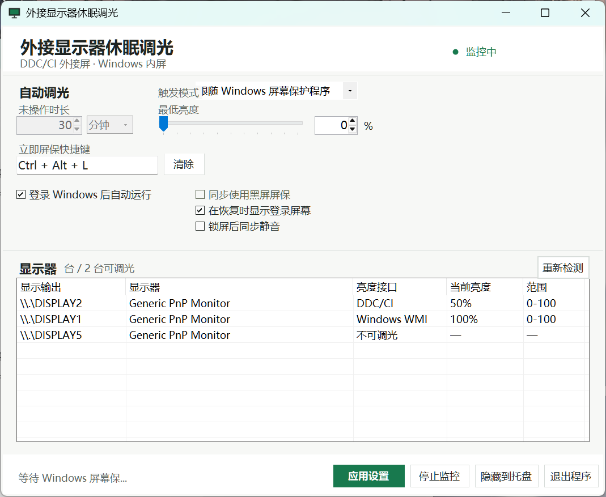

# External Monitor Dimmer

一个用于 Windows 的显示器调光工具。通过 Windows 通用显示接口枚举已启用的屏幕，再通过 DDC/CI 控制外接显示器、Windows WMI 亮度接口控制受支持的笔记本内屏，并在相应状态结束后恢复调暗前的亮度。



## 功能

- 支持 DDC/CI 外接显示器和 Windows WMI 内屏调光
- 按未操作时长或跟随 Windows 屏保自动调暗，并自动恢复亮度
- 自定义未操作时长、最低亮度及立即屏保快捷键
- 快捷键屏保可选退出后锁屏、锁屏后同步静音
- 支持托盘运行和登录 Windows 后自动启动

## 下载

从 [Releases](https://github.com/ruomeng150/ExternalMonitorDimmer/releases/latest) 下载 `ExternalMonitorDimmer.exe` 或完整 ZIP 包。

本程序没有商业代码签名，Windows 可能显示“未知发布者”。

## 使用方法

1. 运行 `ExternalMonitorDimmer.exe`。
2. 选择“触发模式”：

   - “程序检测空闲时间”：设置“未操作时长”。
   - “跟随 Windows 屏幕保护程序”：先在 Windows 中设置屏保，程序会随屏保启动调暗、退出恢复。

3. 设置“最低亮度”，按需设置快捷键或勾选其他选项。
4. 点击“应用并开始”（监控中显示为“应用设置”）。

关闭窗口仅会隐藏到托盘；需要暂停或退出时，点击“停止监控”或“退出程序”。

## 开机自动运行

勾选“登录 Windows 后自动运行”，然后点击“应用设置”或“应用并开始”。程序会把启动副本保存到：

```text
%LOCALAPPDATA%\ExternalMonitorDimmer\ExternalMonitorDimmer.exe
```

取消勾选并再次应用设置即可移除启动项。

## 兼容性

- Windows 10 或 Windows 11
- 建议使用 .NET Framework 4.8 或更高版本
- 外接屏：需支持 DDC/CI；部分型号需要在显示器菜单中启用该选项
- 内屏：显卡/显示驱动需提供 `root\wmi` 下的 `WmiMonitorBrightness` 和 `WmiMonitorBrightnessMethods` 接口
- Windows 没有适用于所有屏幕的单一亮度控制接口。USB/虚拟屏、部分转接设备或未开放亮度接口的驱动仍会出现在列表中，但标为“不可调光”；不会给未知设备发送亮度命令
- 如果内屏显示“不可调光”，可将鼠标放在该行查看接口检测失败信息，并检查显卡驱动和 WMI 服务。程序不会为了检测屏幕修改系统权限或启用被禁用的屏幕

最低亮度 `0%` 只是显示器允许的最低背光亮度，不代表显示器已经断电。

本项目目前仅在华硕天选 4（FX507ZV4）上完成实机测试，测试显示设备包括：

- 内屏：LQ156T1JW05 / 夏普 SHP1574
- 显示器：HKC G27M7Pro / 惠科 HKC2727
- 显示器：SAMSUNG S19B150 / 三星 SAM08A2


其中，夏普内屏与 HKC 显示器的亮度调节功能测试通过；三星显示器不支持 DDC/CI，可正常识别并标注为“不可调光”。

其他机型或显示设备的兼容性尚未验证，请自行测试。

**请自行承担使用本程序所产生的风险。** &#x20;

## 从源码构建

项目不依赖第三方 NuGet 包。请在 Windows PowerShell 5.1 或更高版本运行：

```powershell
powershell.exe -ExecutionPolicy Bypass -File .\build.ps1
```

默认输出文件：

```text
dist\ExternalMonitorDimmer.exe
```

构建脚本使用系统 .NET Framework C# 编译器：

```text
%WINDIR%\Microsoft.NET\Framework64\v4.0.30319\csc.exe
```

## 回归测试与诊断

运行自动化回归检查（隔离配置目录，不会实际锁屏、启动屏保、静音或改变亮度）：

```powershell
powershell.exe -NoProfile -ExecutionPolicy Bypass -File .\tests\run-tests.ps1
```

导出显示器、亮度接口及会话状态的只读诊断：

```powershell
.\ExternalMonitorDimmer.exe --diagnostics "$env:TEMP\ExternalMonitorDimmer-diagnostics.txt"
```

只有显式加上 `--test-brightness-write` 时，诊断才会尝试对可调光的屏幕写入其当前亮度。测试和诊断通过不等于所有硬件均支持调光；实际快捷键锁屏/解锁、内屏调暗/恢复还需在正常桌面环境中验证。

## 数据与系统改动

应用数据保存在：

```text
%LOCALAPPDATA%\ExternalMonitorDimmer\
```

启用相关功能时，程序只修改当前用户范围内的设置：

- 开机启动：`HKCU\Software\Microsoft\Windows\CurrentVersion\Run`
- 黑屏屏保：`HKCU\Control Panel\Desktop`

程序会在应用黑屏屏保前备份原设置，并在停止监控或退出时恢复。

## 卸载

1. 取消“登录 Windows 后自动运行”并应用设置。
2. 点击“停止监控”。
3. 点击“退出程序”。
4. 删除程序文件以及 `%LOCALAPPDATA%\ExternalMonitorDimmer\`。

## 许可证

[MIT License](LICENSE)
